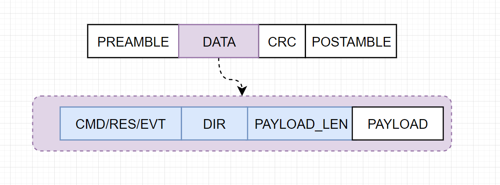

# Custom Protocol

## Objective :

Let's create a basic communication protocol between host and target. 

## Characteristics :

let's define the basic packet characteristics needed in the communication process :

## Control Flow :

In order to keep the system modular we need to define a clear flow of information between host and target. 

- **Command**: Request made by the target or host that might or might not required an answer.
- **Response** : response to a command if required.
- **Event** : packet from target to host at any time without need of command request.

In a Master - Slave configuration the **Event** packet should not be sent.  

## Packet Frame.

**Preamble**:  Constant fields for synchronization.

**Command / Response / Event :** 1 byte corresponds to supported commands / response and events between host and target identifier.

**Payload Length :**  It is a count of all bytes in the payload, does not count the CRC byte, nor post amble byte.

**Dynamic Payload :** Content of the packet in bytes.

**Error Check Byte :** The LRC byte is a XOR of all the packet byte by byte excluding preamble and post-amble.

**Postamble :**  constant field for synchronization. 

## Data Protection.

How can we protect the information sent in a packet, so it cannot be hacked during the transmission ?

There are some basics we can consider to increase the safety of our messages : 

- Do not send stings as a commands. (this can be easily interpreted )
- Use raw hex data to transmit or encrypt your data.

in this implementation we will use a raw data format to protect our data.

## Synchronization.

Preamble will be two or more bytes that indicates the receiver to prepare to receive a new chunk of data, and the postamble indicates the end of it. 

## Acknowledge Frame.

The ACK frame is part of the protocol and its purpose are :

- Notify the sender that a particular packet integrity is intact.

by doing this the sender can make sure the packet has been received intact, if NACK packet is received a re-transmission is required. 

This frame will always be sent from receiver to sender to acknowledge a received packet. 

## Packet Integrity.

if CRC  calculated (Header + Payload ) by the receiver does not match the CRC in the packet frame, means the packet integrity has been compromised during the transmission, in this case the actions to follow are : 

- Receiver send a NACK to sender.
- Sender re-send the packet.

## Packet Flow Graph.

Note that the ACK packet should be always sent first, after processing the command, the target can reply with the response.

## Peripheral Data Processing :

In the current example a UART peripheral has been as a communication medium, in this case both RX and TX in the host and target side is handle by a circular buffer to process to prevent data lost, 

all the commands/events and responses will be queued and transmitted sequentially. 

## State Machine Implementation.

The state machine has been written in UML state diagram convention, and the implementation will follow Herel FSM principles.

 

 

Rx State Machine

Tx State Machine

